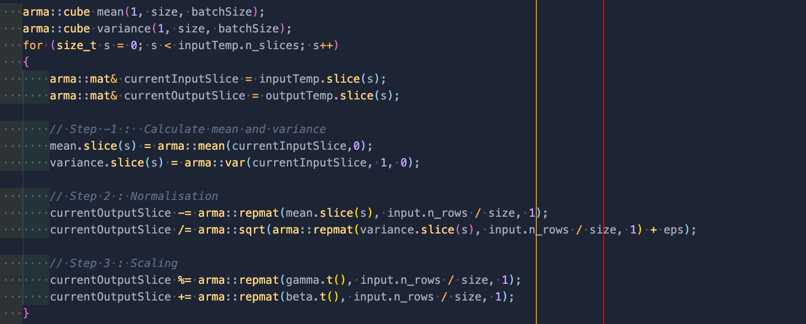

<i>Social Distancing? More like socially distant,by now </i> 😪

This week was pretty uneventful. And the progress made was a bit slow, because I
got stuck in figuring out how to implement the Pixel Shuffle layer, which is my
next feature after the Instance Norm layer.

<b>Pixel Shuffle = A complex shuffling of pixels across channels of an image.</b>

PyTorch [implements](https://github.com/pytorch/pytorch/pull/338/) it in a very
sleek fashion, doing a permutation of a 6D tensor. However, in armadillo, it is
not possible to represent a 6D tensor as far as I know. So, the challenge has
been to understand what exactly has been happenin in 6 dimensions. While I was
able to write a ***Forward()*** method based on the direct translation of the
mathematical formula for the function that the layer represents, I have had a
tough time figuring out how exactly the ***Backward()*** method would look like. I
have asked my mentor about this as well. He was a bit pre-occupied with some
tasks this week and said that he will look into this and try and provide some
insights soon. Hopefully by next week, we will have some more clarity about this
particular layer.

I have also re-designed my implementation of the Instance
Norm layer this week. Previously, I was implementing the layer from scratch.

But, now that [PR #2474](https://github.com/mlpack/mlpack/pull/2474) has been
merged and that I am sure about the correctness of that implementation, I
decided to write the Instance Norm as simply a wrapper layer for the Batch Norm
layer, which is also what PyTorch does btw. A demo of the implementation can be
seen from [this Google Colab notebook](https://colab.research.google.com/drive/18E8a-LTHFOpqa6w53vOsjRz7nbRHLvaf?usp=sharing).
The idea that this approach uses is something that I discussed a couple of weeks
back. For a single image, Instance Norm and Batch Norm calculates the same
thing, so, we can simply transform the (N, C, H, W) input of Instance Norm into
a (1, N*C, H, W) input for Batch Norm and thus re-use existing code.

Other than the Instance Norm and Pixel Shuffle, the other feature that I had
planned to do during the second phase of coding was the Spatial Dropout layer. I
got started with readig up about that layer this week. However, I would like to
start its implementation once the Pixel Shuffle is done. Hopefully both of these
new layers will be complete before the second evaluations. But, if we aren't
able to figure out the Pixel Shuffle one by next week, I might need to take an
extra week from the third phase to complete the Spatial Dropout, which should be
totally fine, because my plan for the third phase already took into account
any pending work from the previous 2 phases. The third phase will mainly
focusing on updating some sections of the mlpack-Tensorflow translator, so that
we can get closer to making that a completely functional repository.

Apart from all of this, I worked on a topic that I find interesting this week
for a bit to distract myself from thinking in 6D continously. I screen recorded
the following video, if anyone's interested.

<!--

<b><i>Continuous Collision Detection in Real time (click the image to view on YouTube)</i></b>

-->

I also tried getting access to GPT-3 API by filling up the form this week, but
haven't got back any reponse so far. All the cool stuff people are doing on
Twitter with it really makes me want to try and play with it myself.

Continuing with the Netflix Series ***Dark***, I had finished Season 1 last weekend,
and I binged season 2 today. By this time, I have lost track of what's the
past, present or future in the series, and I am just watching it to find out
what happends in the end. Definitely would need to watch the entire thing again
later on to fully grasp all the timelines.

Instead of recommending a single song for this week, I would like to recommend
an entire album from Juice WRLD. Yes, it is that good. 🔥

<b><i>Legends Never Die</i></b> by <b>Juice WRLD</b>

See you next week! 
XOXO
