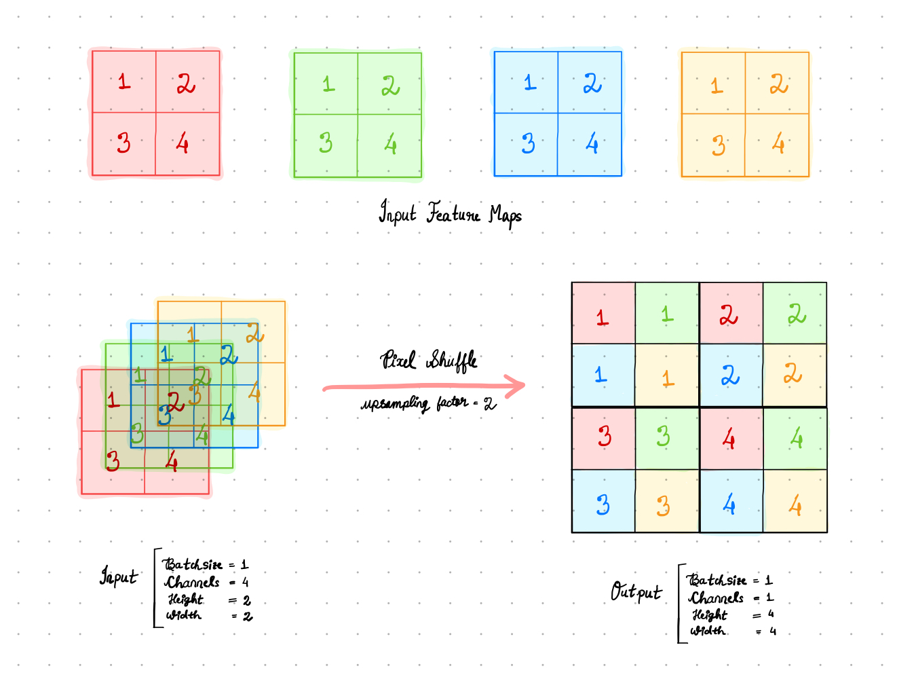
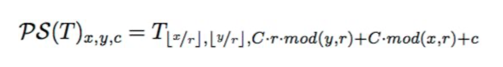
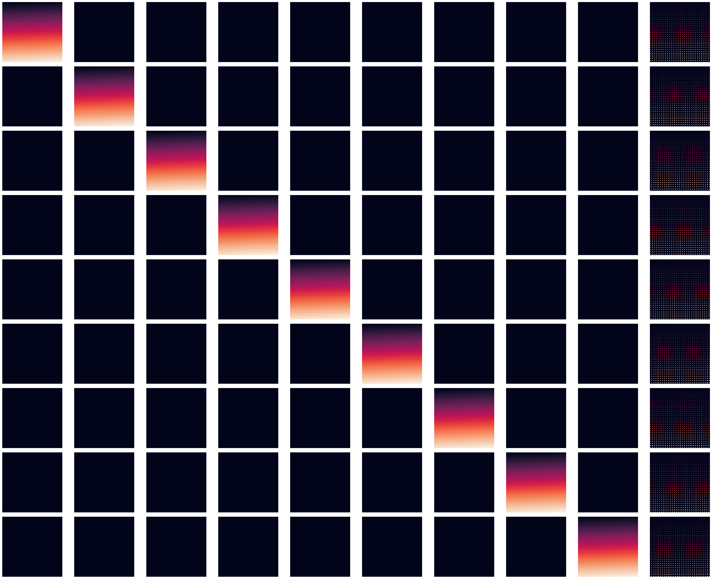
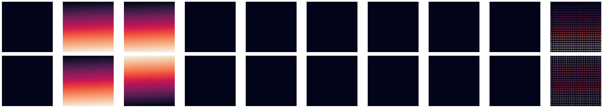
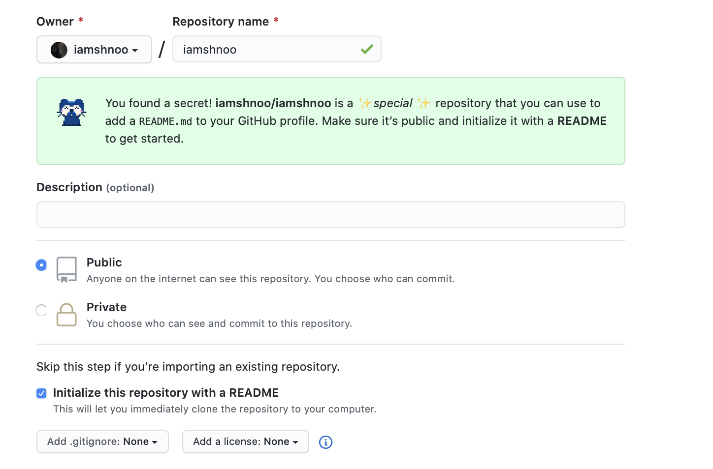

<center><i> Pixels Shuffled. Get it?</i> 😏 <p></p></center>

I have a treat for you today. This blog is probably going to be the most
extensive explanation for the Pixel Shuffle layer on the internet. Needless to
say, I had fun this week working towards making it so.

Let's start off with a self-explanatory image to show you what the operation
really does.

<div align="center">

<p></p>
</div>

Now that you understand what the expected output is, let's look at the simple
code needed to produce this.

```python
for n in range(output.size(0)):
  for c in range(output.size(1)):
      for h in range(output.size(2)):
          for w in range(output.size(3)):
              height_idx = h // upscale_factor
              weight_idx = w // upscale_factor
              channel_idx = (upscale_factor * (h % upscale_factor)) + \
                  (w % upscale_factor) + (c * upscale_factor ** 2)
              output[n, c, h, w] = input[n, channel_idx, height_idx, weight_idx]
```

Pretty simple, right?
In fact, this is just a translation of the equation from the paper where this
layer was born.

<div align="center">

<p></p>
</div>

I did some more experiments to show you (the audience) and also to understand
myself, the working of this layer. The first experiment I did was to only put in
non-zero values for a single feature map and zero all the other feature maps to
see what the nature of the output is. As you have already seen from the first
diagram above, the pixels from each input feature map get mapped to specific
pixels in the output feature map. However, if we scale the larger sized output
feature map to the same size as the input feature maps and then plot it, then
there is very little noticeable difference in the outputs. That is the
conclusion I reached from the visualisation below.

<div align="center">

<p></p>
</div>

The second experiment I tried out was to apply a sequence of values to 2 feature
maps and zero the rest of the feature maps. For this, I generated a linear
sequence of numbers from 1 to x, where x is determined using the size of the
feature map. In the third experiment, I do the same thing, but apply inverted
sequences to the two feature maps.
To one of the feature maps, I apply these sequence as input values
in increasing order and to another feature map, I apply these in a decreasing
order. The idea is, by reversing the orders, the mapping of the pixels should
become a bit more apparent than in experiment 1 above. That did indeed happen,
with most of the top and bottom pixels of output gaining the higher values
corresponding to the higher ends of the series in the inputs. And the middle
portion of the output was tending towards black, due to the effect of sparsely
distributed lower valued input pixels getting mapped over there. The second and
third experiments are visualised with this image, where the colour gradients of
the input maps indicate the pixel values present in it.

<div align="center">

<p></p>
</div>

Note that, for all these 3 experiments I considered input shape as (1, 9, 28,28)
and output shape as (1, 1, 84, 84). Thus, the first 9 images in each row
correspond to the 9 input feature maps each of size 28x28 and the last image is
the single output feature map of a larger size 84x84, but plotted to the same
size for presenting a clearer visual. Details of all the experiments along with
code to reproduce them can be checked from the Google Colab notebook
[here](https://colab.research.google.com/drive/1Be7aIpXMSp_VeL8D5da5p-CYTD-nPIVh?usp=sharing).

With these visuals done, I had a clearer idea about what the layer was doing and
how I should go about approaching the ***Backward()*** method of this layer
which I was stuck with last week, because PyTorch had implemented it using a
complicated 6 dimensional operation.

Initially I was still approaching it incorrectly, thinking that I need to use
```arma::field()``` to represent each batch as a cube of cubes, which was not
only weird but also doesn't fit with the rest of the codebase. However, I soon
figured out that I could add an extra loop in the layer methods to avoid that
unnecessary complication. And, so the ***Backward()*** method became really
simple to implement. In fact, it can be done just by mirroring the code in the
***Forward()*** pass.

```python
for n in range(gy.size(0)):
  for c in range(gy.size(1)):
      for h in range(gy.size(2)):
          for w in range(gy.size(3)):
              height_idx = h // upscale_factor
              weight_idx = w // upscale_factor
              channel_idx = (upscale_factor * (h % upscale_factor)) + \
                  (w % upscale_factor) + (c * upscale_factor ** 2)
              g[n, channel_idx, height_idx, weight_idx] = gy[n, c, h, w]
```

With that completed, it was only a matter of moments before I could complete the
layer along with batch support using an armadillo-only implementation.

The code for matching the PyTorch implementation with the armadillo
implementation can be verified from
[this](https://colab.research.google.com/drive/1JZaptTDo2ey8GcwnJMFh3IwSAlqd7in_?usp=sharing)
Google Colab notebook.

All the code related to this layer referred to in this blog post and the
previous one can also be found from my github
[repository](https://github.com/iamshnoo/mlpack-testing/tree/master/pixel_shuffle),
in case any of the Colab links are not working or if I delete those notebooks to
save space later on.

That's it for the Pixel Shuffle layer. I have started looking into the Spatial
Dropout layer and will provide further details in the next blog.

Coming to other fun stuff that happened this week, GitHub introduced a cool
feature for profile READMEs a few weeks back and I have been enjoying all the
cool ideas smart folks have been coming up with. I made my own this week finally
and personalising it felt really nice. Almost as if GitHub wants this section of
the site to be a place where everyone has some fun.

<div align="center">

<p></p>
</div>

I also binged the 3rd and final season of the Netflix series Dark, on Friday as
usual. Without giving out spoilers, I have to say that the ending they go for
makes so much sense giving a feeling of completion to the series, something that
makes it magical almost. Here's a fan-quote punning on one of the iconic
dialogues from the series.

> Dark is the best Netflix show ever. Never believe anything else.

Music recommendations this week is going to be a bit of K-Pop. Even though I
don't really understand half the lyrics, the songs seem pretty 🔥.
I have been binging mainly on BlackPink, but most of the songs I have been
hearing aren't recent ones and I have heard them one. Here is a semi-new one
however.

<div align="center">

<p><b><i>How You Like That</i></b> by <b>BLACKPINK</b></p>
</div>

See you next week!<br>
XOXO
