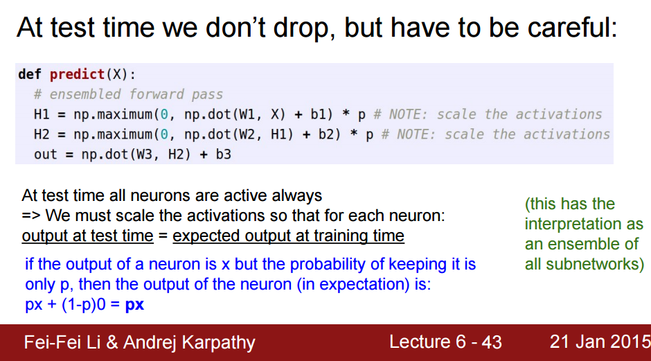
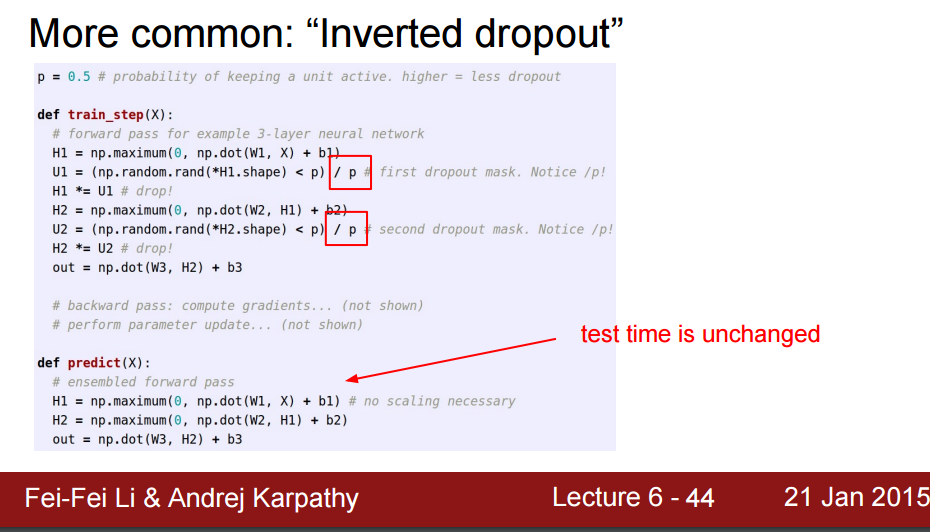
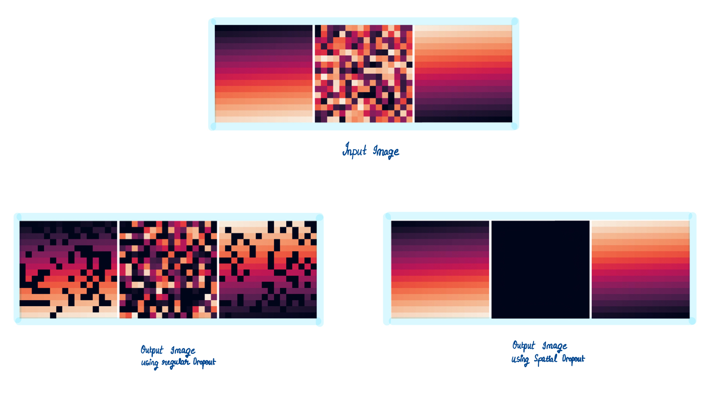
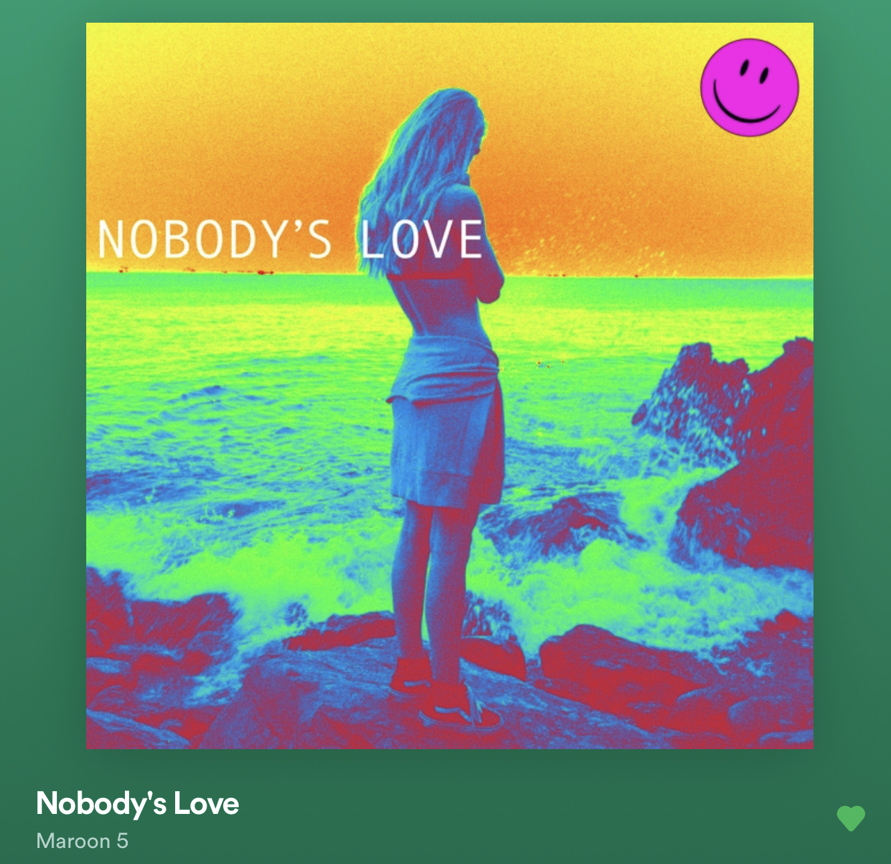

<center><i> Everything is on schedule, surprisingly :) </i> <p></p></center>

A lot of stuff happened this week. I will try and describe the interesting parts
here. Starting with the picture above. I saw the movie ***Birds of Prey and the Emancipation of Harley Quinn***.
Its a pretty fun watch, especially if you are into superhero stuff.

I had mentioned last week, that I will try to complete the Spatial Dropout layer
this week, which might spill over into the next week. However, I was able to
very quickly understand about the layer, once I did some visualisation
experients. Previously, I only knew about what the Dropout layer does, not how
it does it. After going through the code written by **zoq** for the dropout
layer, and reading up on some slides from CS 231n, I understood that in
practice, dropout can be implemented in two ways, and that one of the more
common ways is to use inverted dropout. Including screenshots of the slides
below for easy reference.

<div align="center">

<p><b><i>Method 1 : Scaling the Activation at test time.</i></b></p>
<p></p>

<p><b><i>Method 2 :  Inverted Dropout</i></b></p>
<p></p>
<p></p>
</div>

Once I understood this, the logical next step was to visualise the difference
between Spatial Dropout and this regular Dropout. In PyTorch,
```nn.Dropout(p)``` correponds to the regular Dropout and ```nn.Dropout2D(p)```
corresponds to Spatial Dropout. Using those 2 methods of PyTorch, and with the
help of some matplotlib and numpy, I came up with the following. I took a single
image with 3 channels and passed it through each of the 2 layers separately. All
the code used for visualisation can be seen [here](https://colab.research.google.com/drive/1FZaEeq6pQe8eSQFcpAZXwBsWYhf59OoV?usp=sharing).

<div align="center">

<p></p>
</div>

As we can clearly see, regular dropouts randomly drops out input pixels across
the channels, whereas spatial dropout drops out an entire channel with the
probability p. This feature of spatial dropouts helps to improve performance
when activation maps are highly correlated with each other, as can be seen in
the kernels learnt by the initial few layers of any CNN.

Let's see how the code for the ```Forward()``` method will be different for each of
these 2 layers when implemented in mlpack. (Assume the model is in training
mode, for the following code segments)

```cpp
// Regular Dropout
mask = arma::randu<arma::Mat<eT> >(input.n_rows, input.n_cols);
mask.transform([&](double val) { return (val > ratio); });
output = input % mask * scale;

// Spatial Dropout
size_t batchSize = input.n_cols;
size_t inputSize = input.n_rows / size;
double scale = 1.0 / (1.0 - ratio);
arma::cube inputTemp(const_cast<arma::mat&>(input).memptr(), inputSize, size,
                      batchSize, false, false);
arma::cube outputTemp(const_cast<arma::mat&>(output).memptr(), inputSize,
                        size, batchSize, false, false);
arma::mat probabilities(1, size);
arma::mat maskRow(1, size);
arma::mat mask;
probabilities.fill(ratio);
BernoulliDistribution<> bernoulli_dist(probabilities, false);
maskRow = bernoulli_dist.Sample();
mask = arma::repmat(maskRow, inputSize, 1);

for(size_t n = 0; n < batchSize; n++)
{
  arma::mat& inputImage = inputTemp.slice(n);
  arma::mat& outputImage = outputTemp.slice(n);
  outputImage = inputImage % mask * scale;
}
```

Similarly, let's also compare the ```Backward()``` methods of each.

```cpp
// Regular Dropout
g = gy % mask * scale;

// Spatial Dropout
g.zeros(arma::size(input));
arma::cube gyTemp(const_cast<arma::mat&>(gy).memptr(), inputSize, size,
                    batchSize, false, false);
arma::cube gTemp(const_cast<arma::mat&>(g).memptr(), inputSize, size,
                    batchSize, false, false);

for(size_t n = 0; n < batchSize; n++)
{
  arma::mat& gyImage = gyTemp.slice(n);
  arma::mat& gImage = gTemp.slice(n);

  gImage = gyImage % mask * scale;
}
```

With this comparison out of the way, I am sure that the difference between the
two types of dropout, in terms of their implementation and also the use cases
for each has been established sufficiently clearly. The code snippets above have
been organised into complete files in my
[repository](https://github.com/iamshnoo/mlpack-testing), where the outputs from
PyTorch can be verified to be exactly same as the one from the mlpack
implementations I provide above. Thus, the Spatial Dropout layer is complete in
terms of development.

For the second phase of coding, I had planned to do 3 layers.

- [x] Instance Norm

- [x] Pixel Shuffle

- [x] Spatial Dropout

And I have completed the basic implementations for all of them, and provided the
code for that in the repository I linked above along with visualisation
notebooks and code to prove correctness by comparing with PyTorch outputs of
same functionalities. I have also written extensive blog posts explaining the
working and the correctness of each. I will be formalising these into 3 distinct
PRs over the next couple of weeks, while I start working with the
mlpack-TensorFlow translator.

With that out of the way, I would like to show you something that I painted this
week. Remember the KPop group I was obsessing over last week? I tried painting
one of my favorites from the group. Do note that I am not very good at painting
stuff, but I tried my best and I am happy with the final results, as it looks
exactly how I wanted it to.

<div align="center">

<p><b><i>BLACKPINK Lisa</i></b></p>
</div>

Coming to song recommendations for the week, I binged a lot of songs from The
Chainsmokers this week, along with some Maroon 5. Here is one of them randomly
picked from the list.

<div align="center">

<p><b><i>Nobody's Love</i></b> by <b>Maroon 5</b></p>
</div>

See you next week!<br>
XOXO
