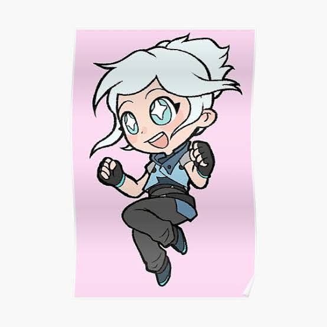
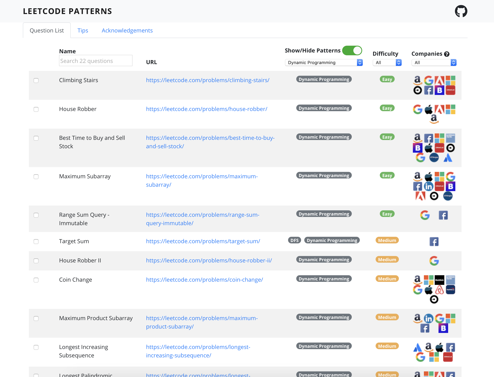
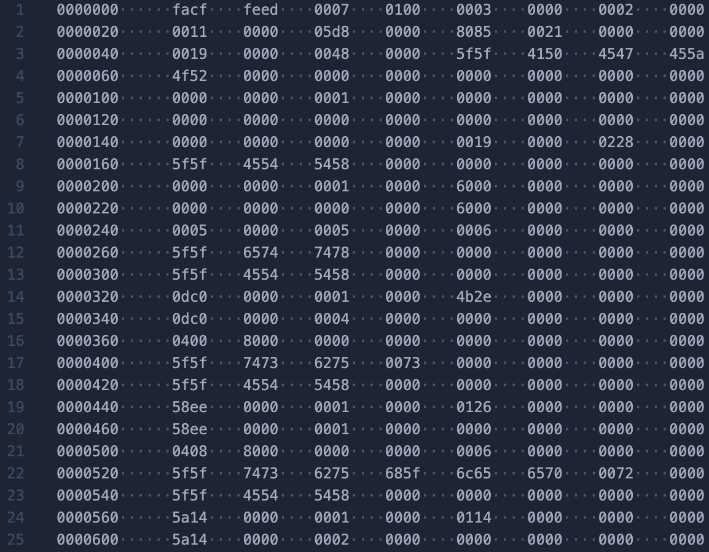
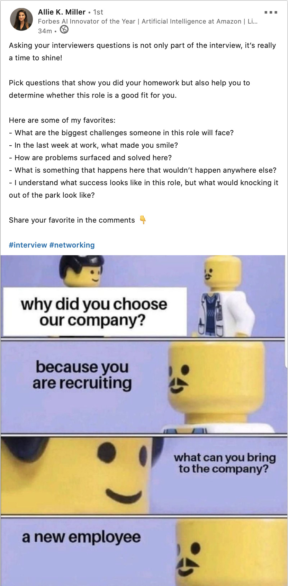
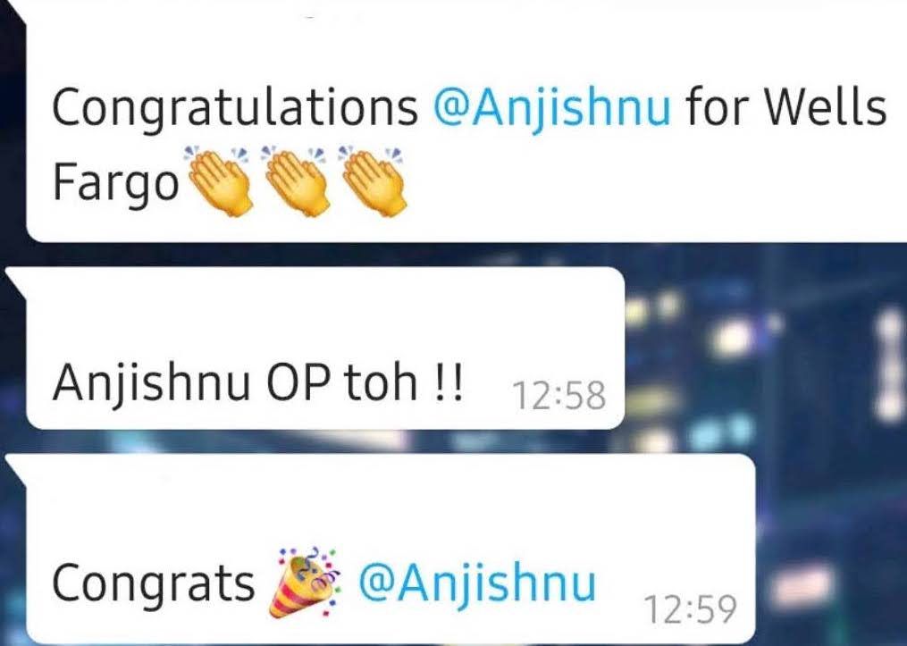

> Wells Fargo. Thank you, for taking a chance with me!😌

⌚️ ***September 10, 09:30 AM***

I attended a zoom meeting with around a hundred other applicants where the
campus recruitment team walked us through the onboarding slides. The prospect of
working for a big financial institute got me really motivated to crack the
online round at 10:45 AM. Prior to this a couple of other companies had visited
our campus during this placement season, but I didn't really vibe with them and
thus couldn't perform up to the expected levels. But, this day I was feeling
something drawing me towards the company, a gut feeling that almost empowered me
to do better.

⌚️ ***September 10, 10:45 AM***

The proctored online exam started with a minor mishap. So, we were supposed to
click a picture using the webcam such that both my face and me holding my ID
card fits into the frame, but I was unable to do that for 5 attempts straight
because the software couldn't recognise the face in my ID. In the end, I decided
to just click a picture of the ID card covering half of my actual face and it
worked. I was able to login finally around 11 AM. The exam had 3 sections.
English, Business Analytics and Coding. And it had a unique restriction, where
once we answered a question, we couldn't go back to change the answer. I
completed the English section fairly easily before time, struggled a bit with
the Business Analytics section, as I was mostly trying to solve them using
common sense rather than having practiced them before. I definitely got a few
questions incorrect in this section. In the coding section, we were given 2
questions and around 1 hr of time. The first question was a simple variation of
the ```merge overlapping intervals``` problem. The second one was based on
optimising the flow in a graph. I solved the first question fairly quickly,
struggled with the second one and could only pass half of the test cases in it,
mainly because I hadn't revised graph based algorithms in a while. Overall, I
was happy with my efforts when the timer ran out. My morale got boosted when I
got to know that everyone got different questions for the coding round, and some
got even direct applications of algorithms like binary search. So, I knew that
they would normalise the scores across the toughness of the different question
sets and I would definitely make it through as I had one of the harder sets
which I was almost able to complete. I got up from my laptop at around 12:40 PM
and had lunch at 1 PM.

⌚️ ***September 10, 07:00 PM***

The list of shortlisted candidates was announced and I had made it to the
interview rounds. I was playing Valorant with my friends when this happened and
had to take a quick break to see if my resume was up to date before mailing it
to the HR from the recruiting team.

<div align="center">

<p><b><i>I play a lot of Jett on Valorant, for those who are familiar</i> 😏</b></p>
<p></p>
</div>

⌚️ ***September 10, 07:30 PM***

I would like to alternately title this section as "I have good friends and
y'all should be jealous", lol. 3 of my friends hopped on to Google Meet and
helped me quickly go through a revision of all the important OOPS, OS,
Networking and DBMS concepts. I am not really sure if I actually learnt anything
new from this phase, but having them by my side gave me the confidence I needed.

⌚️ ***September 10, 09:10 PM***

It was announced that the intereview rounds would be held the next day. I
quickly had dinner, looked through some algorithms (idk why) and went to bed by
12:00 PM exactly.

⌚️ ***September 11, 08:00 AM***

I woke up after a strong 8 hours of peaceful sleep feeling refreshed af. My
first round of interview was scheduled for 9 AM. I wasn't really in the mood to
have too much food right away, so I just put on my favourite shirt (pictured
above), had a couple of biscuits and drank lots of water. Then just to get my
brain cells working and hot, I flipped through some of my favourite problems
from dynamic programming and backtracking.

<div align="center">

<p></p>
</div>
[Thank me later, click this link, go practice now!](https://seanprashad.com/leetcode-patterns/)

⌚️ ***September 11, 09:00 AM***

I was expecting my interviewer to be maybe some newer engineer from the company
as the second round was supposed to be conducted by a Senior Leader. So, I was
very surprised when my interviewer introduced herself as the Vice President of a
particular segment (not gonna name it here obviously, duh) of the company. She
asked me whether I was nervous and I nervously smiled and said "Yes, a bit!"😪
My nerves quickly calmed down as soon as we got past the first few minutes. We
moved on to the answering questions phase and I was able to satisfactorily
answer everything that was asked from basic computer organisation, to OS
concepts like semaphores, virtual memory and paging, to Networking protocols
like TCP/IP and UDP. I am not going into the details of the exact questions
asked because I am probably not allowed to do so (I am not sure, but better to
be safe than sorry). Then she asked me if I was comfortable answering coding
questions from data structures and algorithms, and internally, I was like
"Yeah sure, that's what I prepared for, right? :)" Now, when you read
about interview experiences online, you would see that this part is usually done
on a shared text editor. So, I had google docs at the ready beforehand.
But my interviewer asked me to open an editor and start writing using that. This
was something that was super nice and yet unexpected! After noting down the
question, I walked through the brute force approach and two optimisations for it
and wrote down the pseudo-code for one of those. Then, once we both were
satisified with the reasoning behind the algorihm, she asked me if I was
comfortable writing down working code for it. I asked if I could use C++, as I
had been over-using the language for the past 6 months or so, and she agreed. I
proceeded to write it down, considering all edge cases I could think of and
without using tab for auto-completion. I was pretty confident about not making
syntactical errors, however I had forgotten the return type of one of the
library functions. So, I asked her if I could look that up when the compilation
brought it up. And she said "yes, definitely!". This was also unexpected,
because of all the previous notions I had about coding interviews from reading
stuff online. Once I resolved that, the program compiled and executed in the
next attempt itself and I was kinda impressed with myself for not missing even a
single semi-colon, XD. We walked through another possible optimisation, if the
input satisfied the constraint of being sorted always, but I did not have to
code it. Then she asked me if I had any questions for her. And I really thought
about it a bit before asking how being on the tech side of a financial
institution was different than being a software engineer at any product based
company. We discussed about this for nearly 10 minutes before our time was up. I
got a lot of insights from her response which motivated me further to get
selected. A very important note for this phase. My internet got disconnected
midway and I had to take a few seconds to switch to Wi-Fi. My interviewer called
me from the number on my CV and asked if everything was okay and if I was
rejoining soon. As soon as I joined back, I mentioned how embarassing this was
from my side, but she brushed it aside saying that these are all learning
experiences that we get to be a part of everyday and there was nothing to worry
about. So, people, keep in mind, your interviewer is also human and won't reject
you just because your internet became unstable for a moment. Many opinions exist
for this on the internet, however I can only tell you what I know from my
experiences.

<div align="center">

<p><b><i>Here are the first 25 lines from the binary that got me a job.</i> 👀</b></p>
<p></p>
</div>

⌚️ ***September 11, 12:26 PM***

I got the notification that I had been selected for the next round and that the
interview was scheduled 4 minutes from now. I quickly gobbled down the food that
I was having and got ready for Zoom.

⌚️ ***September 11, 12:30 PM***

I was thirty seconds late to this meeting and was already regretting it. But the
Senior Technical Manager on the other side of the screen put me at ease very
quickly. This entire round was like an extended conversation and I really
enjoyed it, even though everything I was saying was being scored on different
metrics continuously. We discussed different projects from my CV and I was even
asked to show and explain the code for some of them. My work experience in the
form of Google Summer of Code and my internship at the University of Bremen
turned out to be of some use finally as I could make a strong case for myself
from the different algorithms that I implemented as part of those activities.
The next part was going through some situational questions. The key to answer
these is to stay true to yourself and not try to fake it, because the person on
the other side will have enough experience to call your crap within
minutes. We ended the conversation with a 15 minutes of discussion about "Why
Wells Fargo" and I can definitely say that was one of the best conversations I
have ever had. I got to learn so much from him in such a short time, it was
really magical in a way. He asked me at the end to "wait for the HR round" and I
was super excited, because informally that meant I had qualified for the final
HR round.

⌚️ ***September 11, 03:00 PM***

I finally managed to gobble down some proper food for lunch after being too
excited for 2 hours straight. Then I meditated for about half an hour because I
had no clue about when the HR round would be held. I went through some answers
in my mind for some of the common HR questions with my mom and later with my
group of friends. And then I just straight chilled with music for about the next
7 hours or so. At around 9:30 PM, I got to know that my HR round was scheduled
for 10:15 - 10:30 PM.

⌚️ ***September 11, 10:15 PM***

This was a fairly straight-forward round given the fact that it was so late at
night. I was asked about the mythology behind my name 😅, questions about why I
wanted to join Wells Fargo and what I knew about the company, and also some
questions from Machine Learning as I had mentioned about it when I was
describing my experience. When I was supposed to ask a question at the end, I
had gone blank after a tiring day. So, I just asked if based on my entire
interview results today, he could tell me whether I would be better as a
Software Engineer at the company or as a Machine Learning Engineer. In
retrospect, I regret asking this, and should have probably asked something
better, but let's not think too much about the past. The interviewer was very
nice and said politely that he couldn't make any comments directly on that as it
wasn't up to him to make the final decision, but that he had noted down my
interest for ML and would ask the team to factor it in. We also discussed in
details about how different teams work in a connected manner across Wells Fargo
and how all the 3 campuses it has in India are equally distributed in terms of
people working on different ideas. The interview ended with him telling me "Have
a happy weekend! My campus recruitment team will be in touch with you. It was
nice talking with you :)".

<div align="center">

<p><b><i>Don't be a fool like me. Think through your questions first before asking them.</i></b></p>
<p></p>
</div>

⌚️ ***September 11, 11:00 PM***

After discussing about the day with my friends over call, I dropped dead on my
bed at 11:30 PM and tried sleeping. However, you do realise the amount of
adrenaline flowing through me after a day like this. So, I had to give up trying
to sleep around 3 AM and then I spent the next 4-5 hours playing Valorant. I
finally managed to fall asleep from being too tired at 8 AM the next day.

⌚️ ***September 12, 01:30 PM***

I woke up to find my phone flooded with congratulation messages. Apparently the
results had been announced around half an hour back and everyone with a proper
sleep schedule knew about it before I did. I made the cut. And I was super
thankful! I had lunch, replied back individually to everyone who had wished me
or helped me along the journey and then spent the afternoon watching Iron Man
for the n-th time. It would take me a few more days to digest this information,
till then I could now affort to take some time off and do the things that I
enjoy and have been putting off for a long time. Watching Iron Man was top of
the bucket list :)

<div align="center">

<p><b><i>Thank you everyone!!</i></b></p>
<p></p>
</div>

Anyhoo, that was my interview experience for my first job ever! Hope you enjoyed
reading it. I have got miles to improve in different areas and also many hours
of gaming that I need to catch up on. So, I'll leave now. All the best for your
interviews 👍🏻
