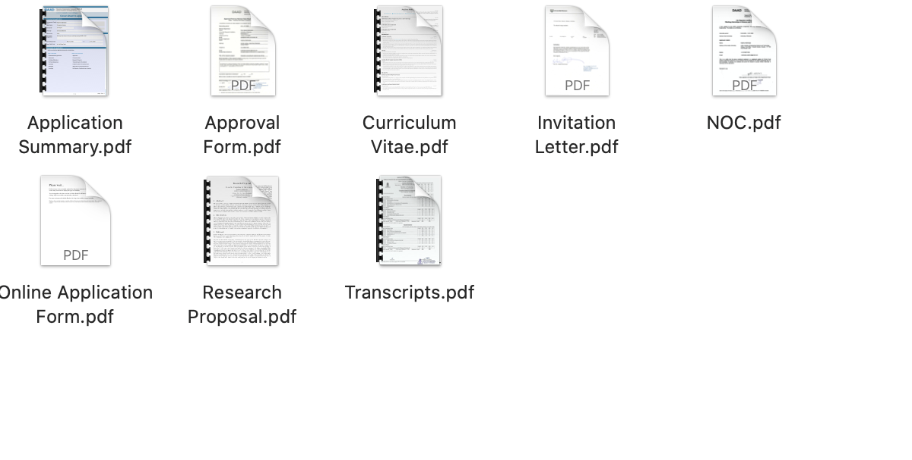

> A lot of people have hit me up on different platforms asking about this. So,
> here, it is, once and for all. DAAD WISE demystified.

Students (from India) apply for summer internships in universities abroad. It is
a pretty common phenomenon and there isn't any reason to deliberate too much
about it. Why do they do it? Well, because there are many good labs working on
top class stuff even outside of India and working there on some project is not
only a massive learning experience, but also looks damn good on any CV when
someone wants to apply for jobs or higher studies later on. Now, the thing is,
most students are not rich enough to pay for the travel and living costs for
these internships out of their own pockets. Here is where scholarships come in
to play. Notice that the internship and the scholarship are 2 different
entities. In this blog, I will be very quickly over the process of getting the
internship first, and then I will detail the application process for the
scholarship. Also, I will restrict myself to Germany only. There are multiple
other excellent options for scholarships, like MITACS, SN BOSE, RISS CMU,Charpak
to name a few. But, I didn't apply to any of those, and can't really elaborate!

***Get the Internship first***

When your pre-final (this means 3rd year for a 4 year
engineering course) year starts, you are expected to know an area of interest.
Something that spikes your imagination, keeps you happy! For me, this was
Computer Vision and Computer Graphics, something at the junction of those two.
Around August-September, your task would be to look up different labs,
professors and institutes working on cool projects in your area of interest and
then email them. Emails have to be smart and to the point. Have a look at the
example below first.

<b><i>Don't copy this word for word, please?</i> 😏</b>

Write out the text for your emails first, very clearly. You need to go through
the lab's current work / projects and recent papers to do so. Choose a project /
topic and mention it explicitly. Explain how your experiences are relevant for
this particular thing. Don't add your resume directly. Instead, add a link to
your online CV (make a simple webpage with the same contents as your CV). Send
the email on a Monday morning 1 hr before 10 AM German time (look up the exact
time of the city you are applying to), so that the email is fresh on the top of
the stack of stuff the professor might go through after coming to the office
after the weekend. A good idea usually is also to include the professor's
assitant by cc'ing the mail, because, we all agree that professors are busy
people and can forget stuff sometimes. Some labs might not have dedicated
assistants, PhD students or PostDocs are equivalent for this purpose in such
cases. Wait a week for a response. If you don't get back any response, do not be
afraid to send a follow-up email in the same thread.

If you don't get back any
response after 2-3 weeks, it is probably better to look at other options. Don't
feel dejected. This isn't the end of the world. Look for other internship
programs worldwide or even in India (IITs are still the best you can get in
India when it comes to academics).

If you receive a positive response, the professor might ask to schedule for a
short interview via video meet. Be prepared to answer basic questions from your
domain of study and also related to the domain of the work being conducted in
the lab. Once the initial conversation is over, you need to ask the professor
for the following documents.

1. Invitation Letter

  

  
  
<b><i>Personal details blurred out.</i> 🥺</b>

  

  

2. Completed Approval Form

  

  
  
<b><i>Personal details blurred out.</i> 😌</b>

  

  

Once you have these 2 documents, you need to get a NOC from your
home institute back in India.

<b><i>Personal details blurred out.</i> 😪</b>

I assume you already have a CV / Resume by this point in your life at the ready.
You would need that for the next step, keep it handy.

You also need to procure transcripts from your university. What are transcripts
and how are they different from your regular academic records that you receive
after every semester? Well, consider it like this, when you are applying for the
scholarship, you need a compilation of all the results across the previous
semesters as one single document called the transcript.

And you need a Letter of Reference from a professor at your home university.
Easy enough to get this, provided someone knows you! The professor will give you
the LOR in a sealed envelope, do not open it. You just have to pack it in with a
couple of other stuff and send it to DAAD.

Once you have all the five documents mentioned above ready, move into step 2.

***Apply for the scholarship***

You need to go the [DAAD WISE website](https://www2.daad.de/deutschland/stipendium/datenbank/en/21148-scholarship-database/?detail=50015295)
and fill in an application form. They tell you exactly what you need to fill and
where you need to fill it. So, just follow the instructions and you should be
good to go. Once you are done completing the application, you would get an
application summary, a single document, that will be around 20 pages long,
composed of some basic info that you filled up when applying, and some other
documents. See the image below.

<b><i>Too many documents, ayyyyy!</i> 👀</b>

Apart from the research proposal, the other things I have already discussed
above. Now, coming to this particular document, you need to write using proper
scientific terms a brief description about the project. Consider it as writing a
2 page summary of the project, but completely technical and written using LaTeX.
Try to include a timeline for all the stuff that you plan to do as part of the
project. You might ask your advisor or a PhD student at his lab to help you out
with this, though the extent of the help will be pretty limited in most cases.

Now, once you are at this stage around October, all you need to do is upload
everything to the [DAAD portal](https://portal.daad.de) under Personal Funding >
Application and Funding overview. (Again, the DAAD WISE website has steps
detailing exactly how to go about this step)

<b><i>To give you an idea of what you are looking for</i> 💯</b>

You also need to send a physical copy of the application summary and the LOR
to the DAAD office in Delhi via post.

<b><i>Takes a couple of days via speed post</i> 👌🏻</b>

Now, you just have to chill till atleast January next year. Unofficially they
let you know by then if you have been selected or not, so that you can move on
with other options. Official Letter of Award and other documents come by in
early March or end February.

Usually around 130-150 people get selected every year. Though the exact number
isn't really made publicly available. So, it is competitive. If you don't get
in, don't feel bad. You can still attend your internship if you manage to find
alternate sources of funding (including self-funding).

The [DAAD WISE Applications Facebook Group](https://www.facebook.com/groups/447364158739762/)
is a great resource before the application deadline and also once results are
announced. Be active there to catch whiff of the latest news about who got
selected that year and other helpful information.

That's all folks! I exhausted my 2 cents about this process, and I couldn't
possibly go in any more depth even if I tried. For future reference, whenever
anyone asks me about DAAD, I am gonna refer them to this post for
clarifications!

Bye 👋🏻👋🏻
