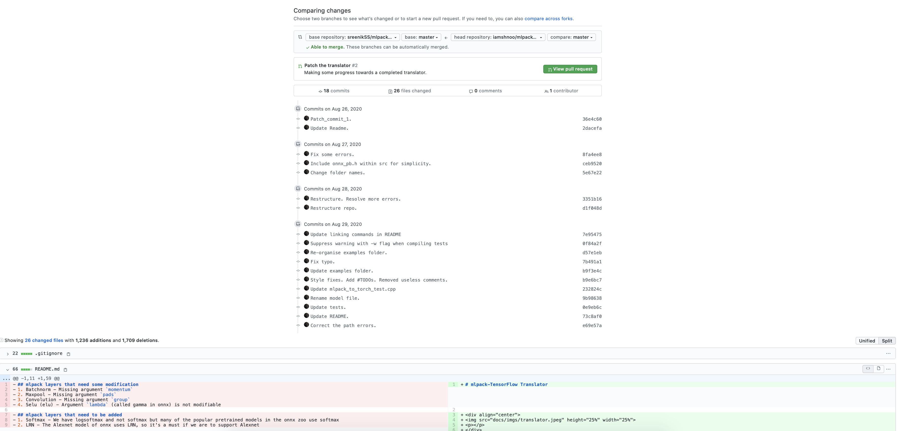

> GSoC came to an end. Kinda sad :(

As mentioned in the previous blogs, I was working on the translator repository
from Sreenik during this last phase. We hopped on a couple of calls and
discussed some design ideas before I went ahead and implemented a ton of
changes. Go have a look at [my fork](https://github.com/iamshnoo/mlpack-Tensorflow-Translator)
and compare it with the [original repo](https://github.com/sreenikSS/mlpack-Tensorflow-Translator)
to understand the magnitude of
transformation that this repo went through during the last 3 weeks of GSoC.
There are still a couple of bugs in some of the functionalities, which Sreenik
mentioned that he is working on currently. But from my end, the work that I had
proposed for the translator for GSoC is complete. The translator is almost at a
useable state right now, except that some of the functions crash sometimes due
to a bug yet unknown.

This part wasn't really super exciting, because the work was pretty easy to
figure out and do, and also because I was constantly feeling the end of the GSoC
period coming closer every day. But, in the end I was very happy with the way
the repo turned out.

I submitted my work product on the final day after making some fine adjustments
to the Translator, and waited for a week or so, before I got to know that I
passed the final evaluations. LinkedIn got flooded with people posting messages
of them passing GSoC evaluations😂, and I got flooded with a flurry of emotions as
I had enjoyed the whole program overall a lot! I would like to keep contributing
to open source, as I feel I was able to learn a lot of new things on my own a lot
faster while going through this program. Thank you, everyone at mlpack, for
giving me this opportunity to work over the summer as a GSoC participant, I will
be forever grateful for this experience!

See you next week? 
XOXO

***EDIT :***

After week 13, on-campus interviews started in my university and I appeared for a
couple of them. I was offered a entry level software developer role at Wells
Fargo. I wrote about this experience in the next blog.
